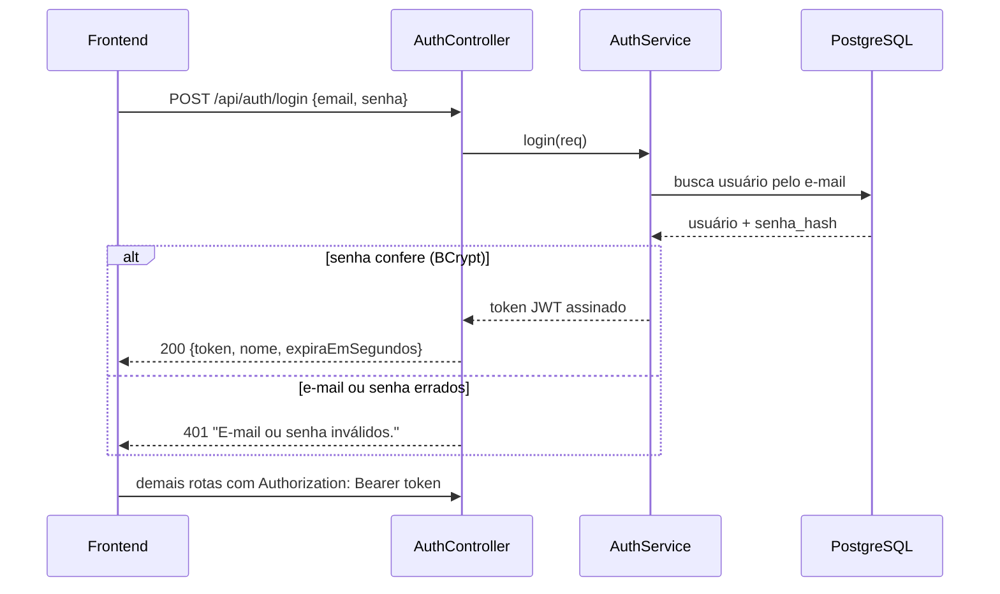

Login com e-mail e senha. A resposta traz um token JWT (HS256) válido por 8 horas, enviado nas demais chamadas no cabeçalho `Authorization: Bearer <token>`.

```mermaid
sequenceDiagram
    participant F as Frontend
    participant A as AuthController
    participant S as AuthService
    participant DB as PostgreSQL
    F->>A: POST /api/auth/login {email, senha}
    A->>S: login(req)
    S->>DB: busca usuário pelo e-mail
    DB-->>S: usuário + senha_hash
    alt senha confere (BCrypt)
        S-->>A: token JWT assinado
        A-->>F: 200 {token, nome, expiraEmSegundos}
    else e-mail ou senha errados
        A-->>F: 401 "E-mail ou senha inválidos."
    end
    F->>A: demais rotas com Authorization: Bearer token
```
